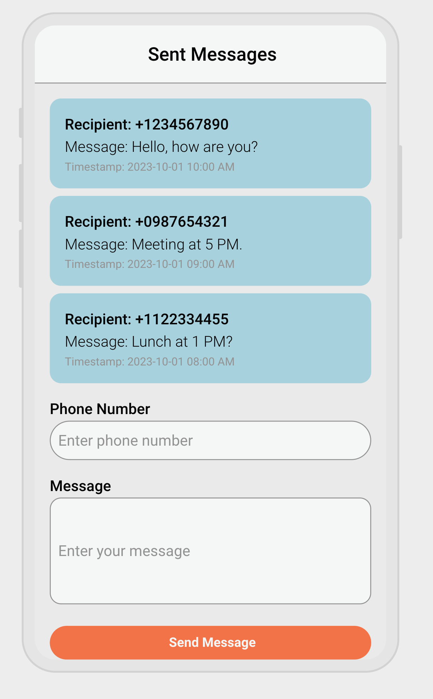

# Kixie Fullstack Engineer Takehome

## Objective
This assignment will focus on a vertical slice of web-based SMS messaging system to test your skills with React (using Recoil for state management) and basic database operations. The task is designed to be completed in 3 hours.

## Project Description
You will implement a simple feature where users can:
- Send an SMS message.
- View a list of recently sent messages sorted by ascending timestamp.
- You are required to build both the frontend and backend components for this feature using the technologies specified.
- We've created basic folder for the backend and frontend in this repository. You can use them as a starting point.

### Requirements
- Frontend (React + Recoil):
  - Send SMS Form: A form where users can input:
    - Recipient Phone Number (simple text input)
    - Message Body (text area)
    - Submit button to send the message.
  - Sent Messages List: After a message is sent, the form should clear, and the sent message should appear in a list above the form showing:
    - Recipient Phone Number
    - Message Body
    - Timestamp
  - Recoil State Management: Use Recoil to manage the state of the form and the list of sent messages locally.

- Backend (Nodejs + Database): You need to implement handlers for the following:
  - POST /send-message: An endpoint that handles creating the message, you can assume the sending of text message occurs in another service and you only need to store the message in the database for this exercise.
  - Get /messages: An endpoint that returns a list of all sent messages ordered by descending timestamp.
  - Use any relational or non-relational datastore (sqlite, postgres, dynamodb, mongodb etc..) to store and retrieve the sent messages with the following schema:
    - message_id
    - recipient_phone
    - message_body
    - timestamp
s
## Technical Requirements
### Frontend
- React for the UI.
- The mockup to follow is as shown below:

- Recoil for managing the state of the form and list of messages.
- Basic styling (focus on functionality, not design). Feel free to use tailwind, chakra, or any other CSS framework if you want to use one.
  - Sent messages should be displayed in a list above the form and their background color should be #add8e6.
  - Be sure to use an appropriate amount of padding and margin to make the message list UI viewable.
- Basic Input validation for the phone number.
  - Phone number should be a string of 10 digits.
- Error handling (e.g., failed message submission).

### Backend
- NodeJS express server to handle form submissions and return sent messages.
- Datastore of your choice for storing messages. Please justify you choice in the README.

## Additional Questions (You can write your solution in-line in this README.md in text format)
- How would you implement an auth layer for the application?
I would use JWT-token based authentication for scalability reasons. We won’t have to manage the users session data on the server so no extra memory is used. We just have to validate the token’s signature and expiration on the server. Since the app already involves SMS, I would also probably add 2-Factor Authentication by SMS for the Log-In portion.

- How would you integrate this backend layer to another service that sends the SMS messages? Would you use a queue system, webhooks, or something else?

I would use a queue system to make sure we don’t lose any messages and also don’t overload the services we are sending to. If a third party like Twilio is down, the messages will be stored in the queue and ready to send when Twilio is back and running again. Queuing allows us to control the flow of outgoing messages, preventing service overloads or sending too many messages at once. I would also use Webhooks to notify us if a message was successfully delivered or failed.

- How might you store phone numbers in a more secure way?
I would encrypt the phone numbers before storing it in a database. I would likely use some sort of encryption key management system like AWS KMS to make sure encryption keys are securely stored and managed.

- How would you make this service realtime if it was a requirement?

I would use websockets to keep an open connection between the client and server so we could see real-time updates if any changes happened. I would use webhooks to immediately get a response that a message was sent successfully or failed.

## Submission Instructions
- Please zip the project and send it to us via email. (make sure to exclude or delete the node_modules folder before zipping).
Update this README to explain any assumptions or design decisions made.

## Time Management Tips
- Focus: Keep the scope small to fit within the 3-hour limit. Focus on getting the core functionality working rather than polishing UI or adding extra features.

